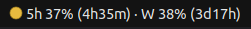

# Claudometer



Desktop notifications and a panel indicator for your **Claude.ai plan usage**
on Linux. Polls the same authenticated endpoint that the Claude.ai web UI
uses (`https://claude.ai/api/organizations/<org>/usage`) on a configurable
schedule, then:

- pops a `notify-send` notification when a window resets, when remaining
  quota falls below a threshold, or when current consumption rate would
  exhaust the window before the next reset;
- shows a colored dot + live percentage label in your system tray
  (see screenshot above — 5h and weekly windows with countdown to each reset).

Two stdlib-only Python scripts. No pip, no venv, no daemon framework.

---

## Requirements

- Linux with systemd (user units) and a desktop session — tested on
  Ubuntu 22.04 / GNOME, but anything with systemd `--user` and an
  AppIndicator-aware shell should work.
- `python3` >= 3.10
- `notify-send` (Debian/Ubuntu: `libnotify-bin`)
- AppIndicator Python binding for the tray:
  - Debian/Ubuntu: `gir1.2-ayatanaappindicator3-0.1`
  - Fedora: `libayatana-appindicator-gtk3`
  - Arch: `libayatana-appindicator`
- A GNOME extension that renders AppIndicators (Ubuntu ships
  `ubuntu-appindicators@ubuntu.com` enabled by default; on vanilla GNOME
  install `gnome-shell-extension-appindicator` and enable it).
- A logged-in browser session at <https://claude.ai> so you can copy your
  `sessionKey` cookie once.

`install.sh` checks each prerequisite and tries to `apt`/`dnf`/`pacman`
install the AppIndicator binding for you (with `sudo`).

## Install

```bash
git clone <this-repo> ~/Projects/claudometer     # or anywhere you like
cd ~/Projects/claudometer
./install.sh                                       # default: poll every 5 min
```

You can place the repo wherever you want — `install.sh` records the absolute
path it was run from into the systemd units, the autostart entry, and the
tray. Move the directory later → re-run `./install.sh` and everything
re-renders.

The installer asks you for **one** thing: your claude.ai `sessionKey` cookie.
To find it:

1. Open <https://claude.ai> in your browser, logged in.
2. Open DevTools (`F12`).
   - **Firefox:** Storage → Cookies → `https://claude.ai` → `sessionKey` → copy the **Value** field.
   - **Chrome/Edge:** Application → Cookies → `https://claude.ai` → `sessionKey` → copy the **Value**.
3. Paste into the installer prompt (input is hidden).

Everything else (organization UUID, polling interval defaults, threshold
defaults, autostart, systemd enable, immediate self-test) is automatic.

## Changing the polling interval

```bash
./install.sh --poll-interval 1     # poll every 1 minute (default 5)
./install.sh --poll-interval 10    # or every 10 minutes
```

This is the only knob that lives in the systemd timer; the rest are in
`config.ini` (see below). Any positive integer (minutes) works. Re-running
the installer with a new value is the supported way to change it — it
re-renders the timer unit and reloads systemd.

## Configuration

Lives at `~/.config/claudometer/config.ini` (or `$XDG_CONFIG_HOME/...`):

```ini
[claudometer]
org_id = <your-org-uuid>          # auto-discovered by install.sh
cookie_file = ~/.config/claudometer/sessionKey

# Which windows to monitor. Recognized names:
#   five_hour    - the rolling 5h session window
#   weekly       - the weekly (7-day) plan cap
#   weekly_opus  - separate Opus weekly cap, when present
windows = five_hour, weekly

# Which alert kinds to enable.
alerts = reset, low_remaining, burn_rate

# "Low remaining" threshold (percent of quota still available).
low_remaining_pct = 20

# Burn-rate sensitivity.
burn_rate_min_history_min = 30
burn_rate_window_min = 60

# Misc.
history_retention_min = 120
auth_error_throttle_hours = 6
schema_error_throttle_hours = 6
http_timeout_sec = 15
```

Edit, save, the next poll picks up the new values. (Polling interval is the
exception — change that with `./install.sh --poll-interval N`.)

## Where things go

| Path                                                      | Purpose                                  |
|-----------------------------------------------------------|------------------------------------------|
| `~/.config/claudometer/config.ini`                       | Config (above).                          |
| `~/.config/claudometer/sessionKey`                       | Cookie, chmod 600.                       |
| `~/.local/state/claudometer/state.json`                  | Rolling history + dedup state.           |
| `~/.local/state/claudometer/last_response.json`          | Most recent raw API response (debug).    |
| `~/.config/systemd/user/claudometer.{service,timer}`     | Rendered systemd units.                  |
| `~/.config/autostart/claudometer-tray.desktop`           | Tray autostart on login.                 |
| `/tmp/claudometer-tray.log`                              | Tray stdout/stderr.                      |

All paths respect `$XDG_CONFIG_HOME` and `$XDG_STATE_HOME`.

## Manual commands

```bash
# Trigger one poll right now (same as the systemd unit).
python3 monitor.py

# Self-test (notification + fetch + parse, no schedule needed).
python3 monitor.py --selftest --debug

# Preview each notification kind (doesn't persist state).
python3 monitor.py \
    --force-alert reset --force-alert low_remaining --force-alert burn_rate \
    --dry-run

# Tail logs.
journalctl --user -u claudometer.service -f
tail -f /tmp/claudometer-tray.log

# When does the next poll fire?
systemctl --user list-timers | grep claude
```

## Tray controls

The tray icon appears next to your system tray. Right-click for: per-window
detail with reset times, "Refresh now" (kicks the monitor), "View raw
response", "View monitor logs", "Quit". Color: green ≥50% remaining, yellow
20–50%, red <20% (driven by the **worst** window).

```bash
# Stop the tray.
pkill -f tray.py

# Restart it.
python3 ~/Projects/claudometer/tray.py &

# Disable autostart (monitor keeps running).
rm ~/.config/autostart/claudometer-tray.desktop
```

If the icon never appears: enable the AppIndicator extension and log out / in
once.

```bash
gnome-extensions enable ubuntu-appindicators@ubuntu.com
# or, on vanilla GNOME after installing the extension package:
gnome-extensions enable appindicatorsupport@rgcjonas.gmail.com
```

## Updating the cookie

Cookies expire (typically weeks). When that happens you'll get a "Claude
usage monitor: auth failed" notification, throttled to once per
`auth_error_throttle_hours`. To refresh:

```bash
./install.sh                         # answer "y" when asked about the cookie
```

## How it works (short version)

- `monitor.py`: oneshot Python script. Reads
  `~/.config/claudometer/sessionKey`, hits
  `https://claude.ai/api/organizations/<org>/usage` with a Firefox-flavored
  User-Agent, parses the JSON with a shape-tolerant walker (since the schema
  isn't documented and changes occasionally), diffs against the previous
  reading kept in `state.json`, fires deduped notifications via `notify-send`.
  Run periodically by a systemd user timer.
- `tray.py`: GTK + AppIndicator daemon. Reads `state.json`
  every 60 s, never touches the network. Updates the panel label and icon
  color from the cached readings.
- The two processes communicate only through `state.json`. Either can be
  restarted independently.

## Uninstall

```bash
systemctl --user disable --now claudometer.timer
rm ~/.config/systemd/user/claudometer.{service,timer}
rm ~/.config/autostart/claudometer-tray.desktop
pkill -f tray.py
systemctl --user daemon-reload

# If you want to wipe state and config too:
rm -rf ~/.config/claudometer ~/.local/state/claudometer
```
